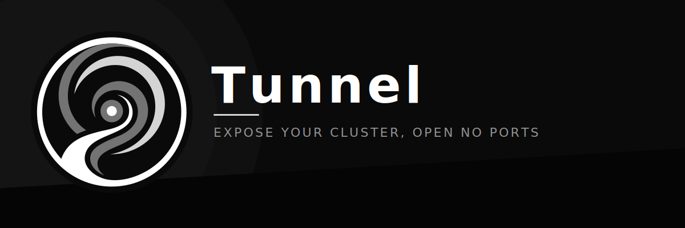
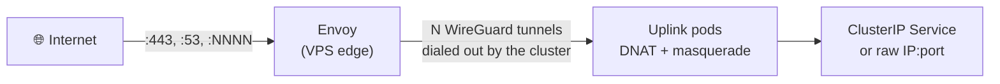

<p align="center">
  
</p>

<p align="center">
  <a href="https://github.com/achetronic/tunnel/blob/master/LICENSE"></a>
  <a href="https://github.com/achetronic/tunnel/blob/master/go.mod"></a>
  <a href="https://github.com/achetronic/tunnel/releases"></a>
  <a href="https://github.com/achetronic/tunnel/stargazers"></a>
  <a href="https://github.com/achetronic"></a>
</p>

Tunnel is a Kubernetes operator that exposes in-cluster TCP and UDP services on the public
IP of a commodity VPS, for clusters that have no public ingress of their own: on-prem, behind
CGNAT, or inside a locked-down VPC. The cluster dials out over WireGuard and the VPS relays
inbound traffic back down that tunnel, so you never open a port on the private network or pay
for a managed load balancer.

## How it works

Inbound traffic lands on a public port of the VPS and follows this path back into the cluster:



- **Envoy** owns the public ports on the VPS. It proxies each one across the tunnels and
  load-balances over the healthy uplinks, and can terminate TLS at the edge when you ask it
  to.
- **WireGuard** is the transport, always dialed out from the cluster, so nothing inbound is
  ever opened on the private network.
- **Uplink pods** terminate the tunnels inside the cluster and forward each port to its
  target, a Service or a raw address. From there it is ordinary cluster networking.

The operator stays off this path. It enrolls the VPS over SSH, keeps the config in sync, and
otherwise leaves the host running stock, inspectable components.

## The two resources

**EdgeNode** is one VPS plus the secure tunnel back into your Kubernetes cluster. You declare
the address, the SSH credentials, the WireGuard overlay and the uplink details; the operator
enrolls the host and wires everything up. It is the single writer over the VPS.

**PortBinding** is where you declare what an EdgeNode exposes: which public ports to open,
where each one routes inside the cluster (a Service or a raw `IP:port`), the per-protocol TCP
and UDP settings, and how TLS is handled at the edge (passthrough, offload or mutual). Group
them in one PortBinding or spread them across several; changes apply live, without dropping
connections.

## Using it

The order is always: create the SSH Secret, create an `EdgeNode`, then route ports with one
or more `PortBinding` objects. The examples below climb from the bare minimum to a full setup.

### The SSH Secret

The EdgeNode reads its credentials from a Secret. Use a `privateKey` (recommended) or a
`password`, plus a `passphrase` if the key is encrypted:

```bash
# Private key
kubectl create secret generic vps-ssh-secret \
  --namespace default \
  --from-file=privateKey=$HOME/.ssh/id_ed25519 \
  --from-file=knownHosts=<(ssh-keyscan 203.0.113.10)

# Or password
kubectl create secret generic vps-ssh-secret \
  --namespace default \
  --from-literal=password='super-secret' \
  --from-file=knownHosts=<(ssh-keyscan 203.0.113.10)
```

The `knownHosts` entry (OpenSSH `known_hosts` format) pins the host key so the enrollment
channel cannot be MITM'd. Verification is on by default: without `knownHosts` the operator
refuses to connect unless you set `ssh.insecureSkipHostKeyVerification: true` on the
EdgeNode.

### Example 1: one TCP port

The smallest thing that works. The EdgeNode runs on defaults, so you only need the address
and the Secret reference.

```yaml
apiVersion: tunnel.achetronic.com/v1alpha1
kind: EdgeNode
metadata:
  name: edge-node
  namespace: default
spec:
  address: 203.0.113.10
  ssh:
    secretRef:
      name: vps-ssh-secret
---
apiVersion: tunnel.achetronic.com/v1alpha1
kind: PortBinding
metadata:
  name: public-web
  namespace: default
spec:
  edgeNodeRef:
    name: edge-node
  bindings:
    - name: http
      protocol: TCP
      listenPort: 80
      target:
        service:
          name: my-web
          namespace: default
          port: 8080
```

Port `:80` on the VPS now reaches the `my-web` Service. Everything else runs on defaults;
Example 4 below shows the full EdgeNode with every knob spelled out.

### Example 2: TCP and UDP, Service and raw IP

One PortBinding can carry several bindings. TCP can enable `proxyProtocol` (v1); UDP has its
own `sessionTimeout` (keep it above the keepalive of whatever you tunnel); and a target is a
Service or a raw IP.

```yaml
apiVersion: tunnel.achetronic.com/v1alpha1
kind: PortBinding
metadata:
  name: public-edge
  namespace: default
spec:
  edgeNodeRef:
    name: edge-node
  bindings:
    - name: https-web
      protocol: TCP
      listenPort: 443
      tcp:
        proxyProtocol: true # backend gets the real client IP
      target:
        service:
          name: internal-ingress
          namespace: networking
          port: 443
    - name: dns-udp
      protocol: UDP
      listenPort: 53
      udp:
        sessionTimeout: 60s
      target:
        address: 10.96.0.10 # straight to an IP, no Service lookup
        port: 53
```

### Example 3: TLS at the edge

A TCP binding can carry a `tls` block so Envoy handles TLS on the VPS. One `secretRef`
points at a standard `kubernetes.io/tls` Secret (what cert-manager produces); the `mode`
decides what the operator reads from it and what it does:

| Mode          | What Envoy does                              | Reads from the Secret          | Key leaves the cluster? |
| ------------- | -------------------------------------------- | ------------------------------ | ----------------------- |
| `passthrough` | Routes by TLS SNI without decrypting         | nothing                        | No                      |
| `offload`     | Terminates TLS on the VPS                    | `tls.crt`, `tls.key`           | Yes                     |
| `mutual`      | Offload plus client-cert (mTLS) verification | `tls.crt`, `tls.key`, `ca.crt` | Yes                     |

```yaml
apiVersion: tunnel.achetronic.com/v1alpha1
kind: PortBinding
metadata:
  name: public-tls
  namespace: default
spec:
  edgeNodeRef:
    name: edge-node
  bindings:
    # Route by SNI, the backend keeps terminating TLS. Nothing sensitive on the VPS.
    - name: sni-passthrough
      protocol: TCP
      listenPort: 8443
      tls:
        mode: passthrough
      target:
        service:
          name: internal-ingress
          namespace: networking
          port: 443

    # Terminate TLS on the VPS. The cert's private key is copied to the edge.
    - name: https-offload
      protocol: TCP
      listenPort: 9443
      tls:
        mode: offload
        secretRef:
          name: web-tls
          namespace: default
      target:
        service:
          name: my-web
          namespace: default
          port: 8080

    # Offload plus verify client certificates against ca.crt from the same Secret.
    - name: grpc-mtls
      protocol: TCP
      listenPort: 9444
      tls:
        mode: mutual
        secretRef:
          name: grpc-mtls
          namespace: default
      target:
        service:
          name: grpc-api
          namespace: default
          port: 50051
```

For `offload` and `mutual` the operator copies the server private key to the VPS, so it
emits a `PrivateKeyOnEdge` warning Event the first time it does. When cert-manager rotates
the Secret, the operator notices, re-pushes the cert, and reloads Envoy on its own.

### Example 4: high availability and scheduling

In production you usually want more than one uplink replica. They run active-active, and
Envoy health-checks each one over the tunnel, so it only routes to replicas whose tunnel is
up and drops a dead one on its own (if they all go down it fails fast instead of
black-holing). The EdgeNode is also where you pin the pods, tune the WireGuard network, and
adjust that health checking under `edge`.

```yaml
apiVersion: tunnel.achetronic.com/v1alpha1
kind: EdgeNode
metadata:
  name: edge-node
  namespace: default
spec:
  address: 203.0.113.10
  ssh:
    port: 22
    user: root
    connectTimeout: 30s
    secretRef:
      name: vps-ssh-secret
      namespace: default
  edge:
    healthCheck:
      interval: 5s # time between /ready probes
      timeout: 2s # per-probe timeout
      healthyThreshold: 2 # consecutive successes before a replica is back in rotation
      unhealthyThreshold: 2 # consecutive failures before a replica is taken out
  tunnel:
    listenPort: 51821
    network: 10.200.0.0/24
    mtu: 1420
    persistentKeepalive: 25
  uplink:
    namespace: tunnel
    replicas: 3
    labels:
      environment: production
    annotations:
      prometheus.io/scrape: "true"
    resources:
      requests:
        cpu: "100m"
        memory: "128Mi"
      limits:
        cpu: "500m"
        memory: "512Mi"
    nodeSelector:
      node-role.kubernetes.io/edge: "true"
    tolerations:
      - key: "dedicated"
        operator: "Equal"
        value: "edge"
        effect: "NoSchedule"
    # affinity defaults to anti-affinity by hostname if you leave it out
```

### Good to know

- Every `listenPort` is unique across all PortBindings pointing at the same EdgeNode, and
  cannot clash with the tunnel's own `listenPort`. This is checked while the EdgeNode
  reconciles, so a conflict surfaces as a failed EdgeNode reconcile, not a rejected
  PortBinding.
- Adding or removing bindings re-renders Envoy and reloads it in place; existing TCP
  sessions survive.
- A healthy EdgeNode re-reconciles every few minutes, not only on changes, so the operator
  catches drift and keeps retrying if something on the VPS goes sideways.

## Deploying the operator 🚀

The operator ships as a Helm chart (CRDs included) published as an OCI artifact. Install it:

```bash
helm install tunnel oci://ghcr.io/achetronic/tunnel/charts/tunnel \
  --namespace tunnel --create-namespace \
  --version <chart-version>
```

See [`values.yaml`](deploy/helm/tunnel/values.yaml) for the full surface.
Upgrade with `helm upgrade ... --reuse-values`.

On [Kind](https://kind.sigs.k8s.io/), build and load both images first, then install with
`--set image.tag` and `--set flags.imageTag` matching the loaded tag so the pods start without
pulling (`imagePullPolicy: IfNotPresent`).

## Configuration ⚙️

Everything is configured on the manager. There is nothing to set per resource beyond the
CRDs themselves.

### EdgeNode annotations

Deliberate, operator-driven switches you set with `kubectl annotate edgenode <name> <key>=true`:

| Annotation                               | Effect                                                                                                                                                |
| ---------------------------------------- | ----------------------------------------------------------------------------------------------------------------------------------------------------- |
| `tunnel.achetronic.com/restart-envoy`    | Restart Envoy on the VPS on the next reconcile (how you apply a new Envoy version). One-shot: the operator does it and removes the annotation itself. |
| `tunnel.achetronic.com/skip-deprovision` | On EdgeNode deletion, skip the SSH teardown of the VPS. The in-cluster uplink resources are still cleaned up.                                         |

### Manager flags

| Flag                                                                 | Default                      | What it does                                                                        |
| -------------------------------------------------------------------- | ---------------------------- | ----------------------------------------------------------------------------------- |
| `--envoy-version`                                                    | `1.29.3`                     | Envoy release installed on every managed VPS.                                       |
| `--tunnelctl-dir`                                                    | `/opt/tunnelctl`             | Directory the operator reads the static tunnelctl binaries from to push to the VPS. |
| `--image-repo`                                                       | `ghcr.io/achetronic/tunnel`  | Base repo for operator-managed images; the uplink image is `<repo>/uplink:<tag>`.   |
| `--image-tag`                                                        | `latest`                     | Tag for those images; set it to the operator version so the uplink tag matches.     |
| `--leader-elect`                                                     | `false`                      | Leader election so only one manager is active (HA).                                 |
| `--health-probe-bind-address`                                        | `:8081`                      | Address for the liveness/readiness probes.                                          |
| `--metrics-bind-address`                                             | `0` (off)                    | Metrics address, e.g. `:8443` (HTTPS) or `:8080` (HTTP).                            |
| `--metrics-secure`                                                   | `true`                       | Serve metrics over HTTPS with authn/authz.                                          |
| `--enable-http2`                                                     | `false`                      | Enable HTTP/2 on the metrics and webhook servers.                                   |
| `--metrics-cert-path` / `--metrics-cert-name` / `--metrics-cert-key` | `""` / `tls.crt` / `tls.key` | Custom certificate for the metrics server.                                          |
| `--webhook-cert-path` / `--webhook-cert-name` / `--webhook-cert-key` | `""` / `tls.crt` / `tls.key` | Custom certificate for the webhook server.                                          |

### Environment variables

Honored by both binaries (manager and uplink):

| Variable     | Default | Values                           | What it does                                                              |
| ------------ | ------- | -------------------------------- | ------------------------------------------------------------------------- |
| `LOG_FORMAT` | `json`  | `json`, `text`                   | Log output format; `text` is the readable console format for development. |
| `LOG_LEVEL`  | `info`  | `debug`, `info`, `warn`, `error` | Minimum log level; `debug` shows the per-step enrollment detail.          |

## Observability 🔭

The Envoy admin port is never exposed to the internet.
Each uplink pod forwards its own `:9901` through the tunnel to Envoy's admin interface.
That bridge is the intended way to scrape metrics and debug;
there is deliberately no large status blob on the resources.

```bash
# Every uplink pod exposes Envoy's admin on its own pod IP at :9901, so any pod
# in the cluster can reach it directly, no exec into the uplink needed.
kubectl -n tunnel get pods -l app.kubernetes.io/name=uplink -o wide

# Prometheus metrics, straight against an uplink pod IP
kubectl run tmp --rm -it --restart=Never --image=curlimages/curl -- \
  curl -s http://<uplink-pod-ip>:9901/stats/prometheus

# Same path for ad-hoc debugging (config_dump, clusters, ...)
kubectl run tmp --rm -it --restart=Never --image=curlimages/curl -- \
  curl -s http://<uplink-pod-ip>:9901/config_dump
```

Or let Prometheus scrape the uplink pods directly with a PodMonitor:

```yaml
apiVersion: monitoring.coreos.com/v1
kind: PodMonitor
metadata:
  name: tunnel-uplink-envoy
  namespace: tunnel
spec:
  selector:
    matchLabels:
      app.kubernetes.io/name: uplink
  podMetricsEndpoints:
    - targetPort: 9901
      path: /stats/prometheus
      scheme: http
```

Any replica works; they all reach the same Envoy.

## Contributing 🤝

Issues and PRs are welcome. For a bug, say what you expected, what happened, and how to
reproduce it. For a feature, explain the use case. Agreeing on the approach before writing
code is easier on everyone.

### What you need

- Go (the version pinned in `go.mod`), Docker, [Kind](https://kind.sigs.k8s.io/) and `kubectl`.
- The rest of the tooling (`controller-gen`, `kustomize`, `setup-envtest`, `golangci-lint`) is
  downloaded into `./bin` by the Makefile on first use, so there is nothing else to install.
- The unit and integration tests run against a fake SSH layer and need no VPS. To exercise the
  real data path you also need a throwaway Linux box the operator can reach over SSH.

### Local loop with Kind

The manager runs on your host against a Kind cluster; the uplink workload runs inside it.

```bash
kind create cluster --name tunnel   # a throwaway cluster
make install                        # install the CRDs into it
make run                            # run the operator against the current kubeconfig
```

In another shell, edit the samples (VPS address, SSH Secret, target Service) and apply them:

```bash
kubectl apply -f config/samples/tunnel_v1alpha1_edgenode.yaml
kubectl apply -f config/samples/tunnel_v1alpha1_portbinding.yaml
kubectl get edgenodes,portbindings -A
```

The operator enrolls the VPS over SSH and creates the uplink StatefulSet. To run the full path
locally, build the uplink image and load it into Kind so the pods start without pulling, then
run the manager with the matching tag:

```bash
make build-tunnelctl                                            # cross-compile the agent into ./bin/tunnelctl
make docker-build-uplink UPLINK_IMG=ghcr.io/achetronic/tunnel/uplink:dev
kind load docker-image ghcr.io/achetronic/tunnel/uplink:dev --name tunnel
go run ./cmd/main.go --image-tag=dev --tunnelctl-dir=./bin/tunnelctl
```

Tear it all down with `kind delete cluster --name tunnel`.

### Tests and quality gate

```bash
make test        # unit and integration tests (envtest); also runs manifests, generate, fmt, vet
make test-race   # the same suite under the race detector
make lint        # golangci-lint (make lint-fix to autofix)
make verify      # the full gate: fmt, vet, lint, test, test-race
```

`make test-e2e` spins up its own throwaway Kind cluster, runs the end-to-end suite and tears
it down, so never point it at a cluster you care about. If you touch `api/**/*_types.go` or any
kubebuilder marker, run `make manifests generate` to refresh the CRDs and generated code.

### Issues and PRs

Open an issue first so we can agree on the change. Then send the PR from a branch on your
fork: tidy commits, `make verify` green, and a link to the issue it closes (`Fixes #123`).

### On using AI

A lot of code and reviews these days are produced by AI. That is not how this project is run.
Leaning on AI to help you write code, tests, or documentation is fine, and often genuinely
useful. Letting it lower the bar is not: do not ship code you have not read and understood,
and do not open an issue or PR whose text is pasted from a model you never stopped to think
through.

If you use AI, you still own what you submit. Read every line, make sure it is correct, and
write your issues and PRs in your own words so a human can follow the reasoning. We treat this
codebase with the care a project like this deserves, so it improves over time, not the other
way around. Quality is never traded for speed. AI is a great tool when it raises what you
produce, not when it stands in for understanding it.

The agentic context for this project lives in [`.agents/`](.agents/) and is kept current with
every iteration. If you work with an AI agent on this code, the first thing you tell it is:

read the files in `.agents/` before doing anything.

## License

Apache 2.0. See [LICENSE](LICENSE).

Created with ❤️ from the Canary Islands 🇮🇨
